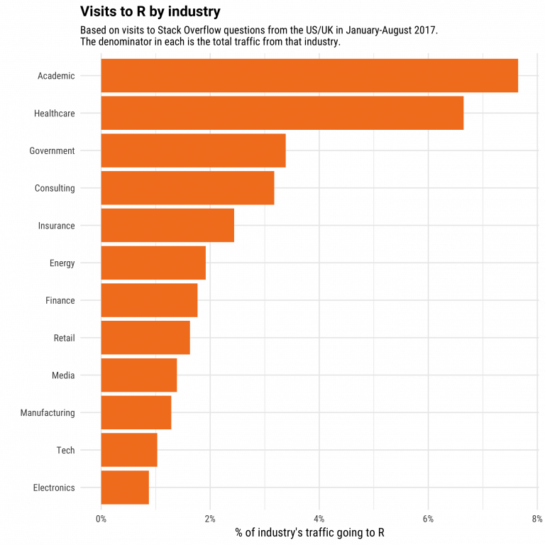
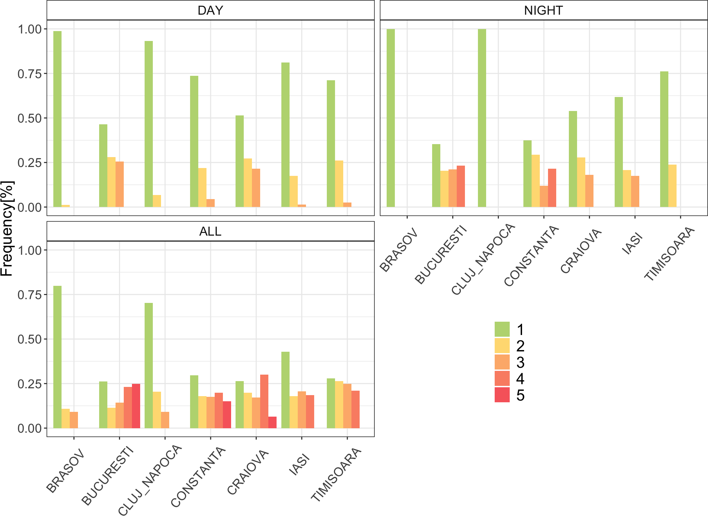
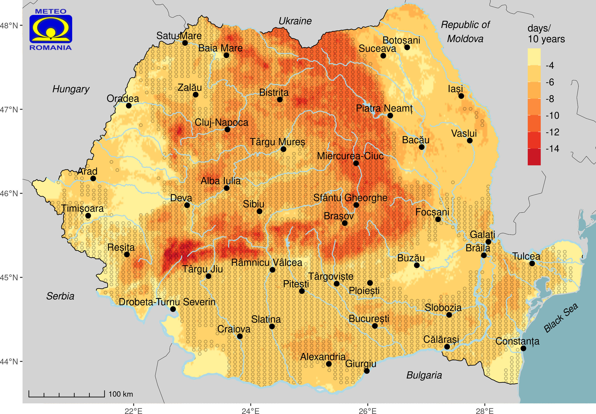
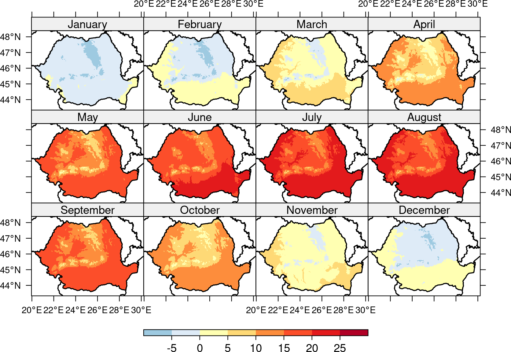
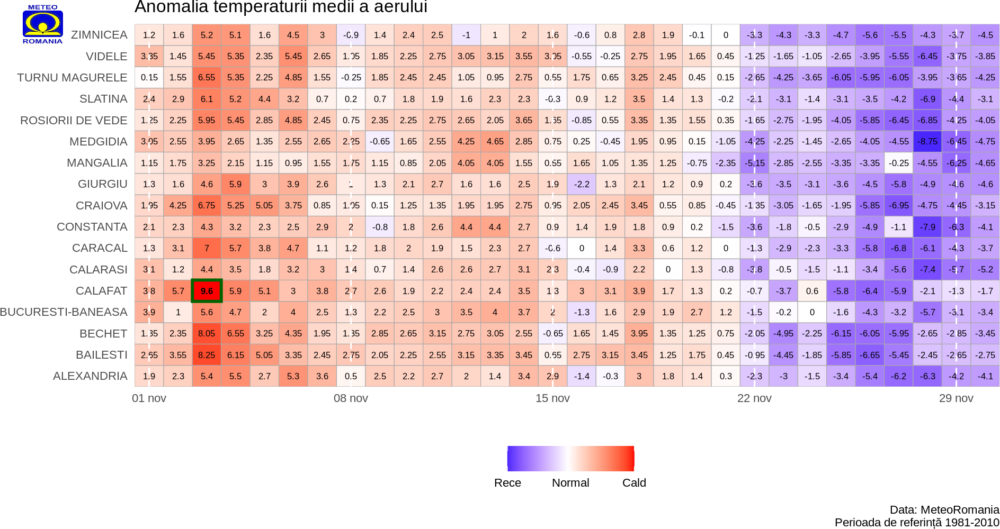

```{r setup, include=FALSE}
knitr::opts_chunk$set(echo = FALSE)
```

## Ce este R-ul

R-ul este un limbaj de programare si un software gratuit dezvoltat de Ross Ihaka si Robert Gengleman in 1993. R-ul pune la dispoziție un catalog larg de methode statistice si grafice. El include algoritmi de machine learning, regresii lineare, serii de timp, operații statistice complexe. Programul funcționează pe baza librăriilor care sunt și ele scrise la rândul lor în limbaj R. Dar pentru cerințe mai mari majoritataea librăriilor sunt scrise in **C++** sau **Fortran**. \#\# Ceva despre R

## Ceva despre R

{width="609"}

{width="516"}

## Ce putem face cu R-ul?

-   Operații matematice simple

```{r echo=T}
2+2 
```

-   Statistica descriptiva

```{r echo = TRUE}
library(openair)
summary(mydata)
```

-   Crearea de funcții și librării pentru automatizarea proceselor

```{r echo = TRUE, eval=F}
library(openair)
library(dplyr)
library(lubridate)

d <- mydata%>%filter(year(date) == 2002)%>%group_by(year(date)) %>% summarise(mn_nox = mean(nox))
```

## Ploturi

{width="492"}

## Si mai multe ploturi

{width="544"}

## {width="565"}

{width="618"}

## Harti/grafice interactive

[urban risk frequenc](file:///Volumes/Z_vld/D/2022/urban_climate/Suppl_04_20220427_HHR_day.html)

## Aplicatii web

R shiny

{width="447"}

Alte aplicații: [URCLIM](https://climatologis.shinyapps.io/urclim/) [SUSCAP ROCliB Data Explorer](http://suscap.meteoromania.ro/en/roclib)

## Link-uri utile

<https://cran.r-project.org/> <http://www.cookbook-r.com/> <https://r-charts.com/> <https://stackoverflow.com/> www.github.com etc.
